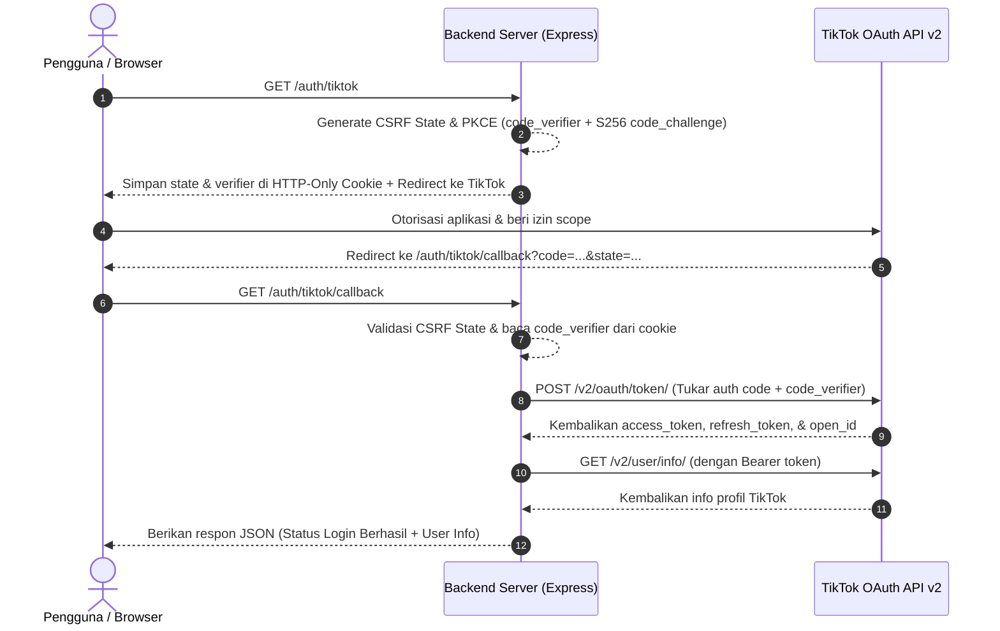

# TikTok Login Kit Backend Server

<p align="center">
  
  
  
  
  
</p>

Backend authentication service berbasis **Node.js** dan **TypeScript** untuk integrasi **TikTok Login Kit (OAuth 2.0)**. Dilengkapi dengan proteksi keamanan standar industri seperti **CSRF State** dan **PKCE (Proof Key for Code Exchange)** via **S256**, serta integrasi endpoint **User Info** dan **Refresh Token**.

---

## 📑 Daftar Isi

- [Fitur Utama](#-fitur-utama)
- [Struktur Direktori](#-struktur-direktori)
- [Alur Kerja Otentikasi (OAuth 2.0 + PKCE)](#-alur-kerja-otentikasi-oauth-20--pkce)
- [Prasyarat](#-prasyarat)
- [Instalasi & Pengaturan](#-instalasi--pengaturan)
- [Daftar Endpoint API](#-daftar-endpoint-api)
- [Script NPM](#-script-npm)
- [Praktik Keamanan](#-praktik-keamanan)
- [Lisensi](#-lisensi)

---

## 🚀 Fitur Utama

- **OAuth 2.0 Resmi TikTok v2**: Menggunakan endpoint otorisasi dan token resmi TikTok API v2.
- **Keamanan Tingkat Lanjut (PKCE & CSRF)**:
  - Generasi `code_verifier` & `code_challenge` (S256 / SHA-256) dinamis.
  - State token acak untuk mencegah serangan *Cross-Site Request Forgery* (CSRF).
  - Cookie `httpOnly` & `SameSite=Lax` untuk melindungi parameter autentikasi sementara dari serangan XSS.
- **Fetch Profil Pengguna (User Info)**: Mengambil data dasar pengguna (`open_id`, `display_name`, `avatar_url`, dll.) segera setelah login.
- **Refresh Token Endpoint**: Mendukung rotasi dan perpanjangan access token yang telah kadaluwarsa.
- **Type-Safe**: Dibangun dengan TypeScript untuk maintainability tinggi dan meminimalkan runtime error.

---

## 📂 Struktur Direktori

```text
login-kit-tiktok/
│
├── tiktok-login-server/             # Backend service Express + TypeScript
│   ├── src/
│   │   └── index.ts                 # Server Express, routing OAuth & middleware
│   ├── .env.example                 # Template variabel lingkungan
│   ├── .gitignore                   # Daftar file/folder yang diabaikan Git
│   ├── package.json                 # Manifest proyek & dependencies
│   ├── package-lock.json            # Lockfile dependencies npm
│   └── tsconfig.json                # Konfigurasi TypeScript compiler
│
├── .gitignore                       # Root ignore
└── README.md                        # Dokumentasi utama proyek
```

---

## 🔄 Alur Kerja Otentikasi (OAuth 2.0 + PKCE)



---

## 📋 Prasyarat

Sebelum memulai, pastikan telah menyiapkan:

1. [Node.js](https://nodejs.org/) versi **18.x atau lebih baru**.
2. Akun di [TikTok for Developers](https://developers.tiktok.com/).
3. Aplikasi terdaftar di TikTok Developer Portal dengan produk **Login Kit**:
   - Dapatkan **Client Key** dan **Client Secret**.
   - Tambahkan Redirect URI: `http://localhost:4000/auth/tiktok/callback` (atau sesuai konfigurasi domain Anda).

---

## 🛠 Instalasi & Pengaturan

1. **Clone repository:**
   ```bash
   git clone https://github.com/<username>/<repo-name>.git
   cd login-kit-tiktok/tiktok-login-server
   ```

2. **Install dependensi:**
   ```bash
   npm install
   ```

3. **Konfigurasi Environment Variables:**
   Salin file `.env.example` menjadi `.env`:
   ```bash
   cp .env.example .env
   ```
   Buka file `.env` lalu sesuaikan isinya:
   ```env
   PORT=4000
   NODE_ENV=development

   # Kredensial dari TikTok Developer Portal
   TIKTOK_CLIENT_KEY=masukkan_client_key_anda
   TIKTOK_CLIENT_SECRET=masukkan_client_secret_anda

   # Redirect URI (Harus sama persis dengan yang terdaftar di TikTok Developer)
   TIKTOK_REDIRECT_URI=http://localhost:4000/auth/tiktok/callback

   # Scopes yang dibutuhkan
   TIKTOK_SCOPES=user.info.basic
   ```

4. **Jalankan Server dalam mode Development:**
   ```bash
   npm run dev
   ```
   Server akan berjalan di `http://localhost:4000`.

---

## 🔌 Daftar Endpoint API

| Method | Endpoint | Deskripsi |
| :--- | :--- | :--- |
| `GET` | `/` | Health check status server |
| `GET` | `/auth/tiktok` | Inisiasi alur login & redirect ke halaman otorisasi TikTok |
| `GET` | `/auth/tiktok/callback` | Callback URL penerima `authorization_code` dari TikTok |
| `POST` | `/auth/refresh` | Memperbarui `access_token` menggunakan `refresh_token` |

### Contoh Request Refresh Token:
```http
POST /auth/refresh HTTP/1.1
Host: localhost:4000
Content-Type: application/json

{
  "refresh_token": "rft.example_refresh_token_string"
}
```

---

## 📦 Script NPM

Jalankan perintah berikut di dalam direktori `tiktok-login-server/`:

| Command | Kegunaan |
| :--- | :--- |
| `npm run dev` | Menjalankan server dalam mode watch / hot-reload dengan `ts-node`/`nodemon` |
| `npm run build` | Melakukan kompilasi file TypeScript (`tsc`) |
| `npm start` | Menjalankan server produksi |

---

## 🛡 Praktik Keamanan

- **Jangan pernah melakukan commit file `.env`**: File konfigurasi riil berisi data sensitif seperti `TIKTOK_CLIENT_SECRET`. Pastikan `.env` selalu tercantum dalam `.gitignore`.
- **Gunakan HTTPS di Lingkungan Produksi**: TikTok mewajibkan HTTPS untuk Redirect URI di tahap *Live/Production*. Aktifkan opsi `secure: true` pada cookie saat menggunakan HTTPS.
- **Proteksi PKCE**: Implementasi PKCE melindungi aplikasi dari serangan *authorization code interception*.

---

## 📄 Lisensi

Proyek ini didistribusikan di bawah lisensi [MIT](LICENSE).
